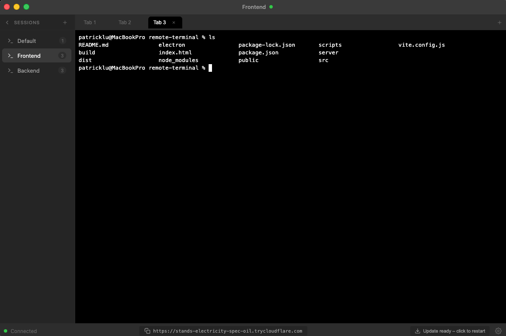

# CodePress Desktop

A native terminal for macOS that you can connect to remotely from your phone — so you never have to stop working.

## Features

- **Native Terminal** - A full-featured terminal with sessions, tabs, and a modern interface
- **Remote Access** - Connect from your phone via secure tunnel when you're away from your desk
- **Sessions Sidebar** - Organize your work with multiple named sessions, each with its own set of tabs
- **Terminal Tabs** - Run multiple terminal instances within each session for parallel workflows
- **Session Persistence** - Your terminal sessions stay running, reconnect anytime from any device
- **Mobile-Optimized Interface** - Touch-friendly experience designed for on-the-go use
- **Auto-Updates** - Stay current with automatic update notifications

## Use Cases

- Use as your daily terminal with organized sessions and tabs
- Step away from your desk and continue working from your phone
- Check on long-running processes remotely
- Quick server maintenance when you're on the go

## Downloads

Check the [Releases](https://github.com/quantfive/codepress-desktop-releases/releases) page for the latest downloads.

### macOS
- **Apple Silicon (M1/M2/M3)**: Download the `arm64.dmg` file

### Windows & Linux
- Coming soon

## Installation

1. Download the appropriate installer for your platform from the releases page
2. Open the DMG file and drag CodePress to your Applications folder
3. Launch CodePress from your Applications
4. Use the tunnel URL in the status bar to connect from your phone

## Recommended Setup: Chrome Remote Desktop

For the best experience, we recommend pairing CodePress with [Chrome Remote Desktop](https://remotedesktop.google.com/):

### Why use both?

- **Wake your computer** - Use Chrome Remote Desktop to wake your sleeping Mac before connecting with CodePress
- **Screen viewing** - See your desktop GUI alongside your terminal for a complete remote experience
- **Failsafe access** - If you need to interact with GUI applications or dialogs, Chrome Remote Desktop has you covered

### Setup Chrome Remote Desktop

1. Install [Chrome Remote Desktop](https://remotedesktop.google.com/access) on your computer
2. Enable remote access and set a PIN
3. Install the Chrome Remote Desktop app on your phone
4. Use it to wake your computer, then connect with CodePress for terminal access

This combo gives you full remote access to your machine — GUI when you need it, and a fast, mobile-optimized terminal with CodePress.

## Issues

For bug reports and feature requests, please use the [main repository issues](https://github.com/quantfive/codepress-terminal/issues).
